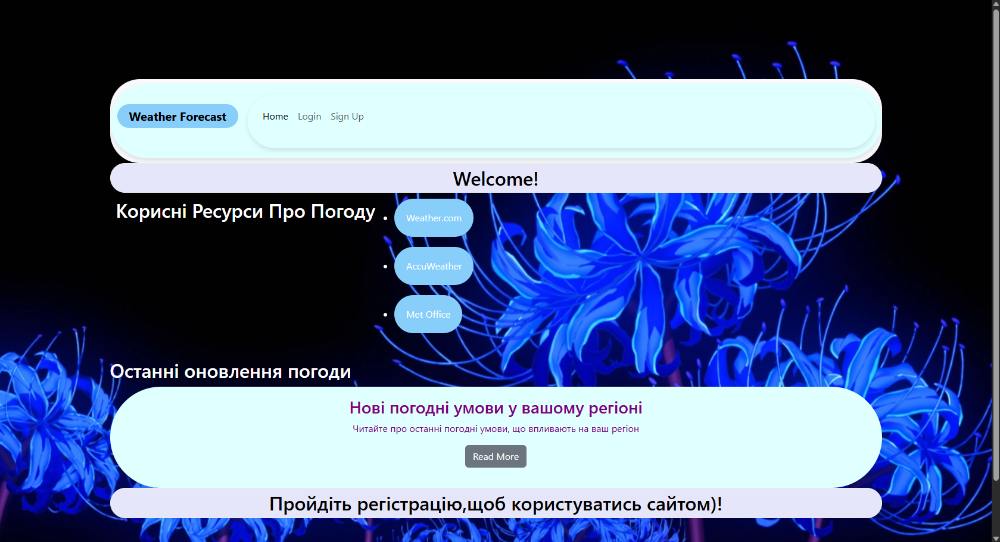
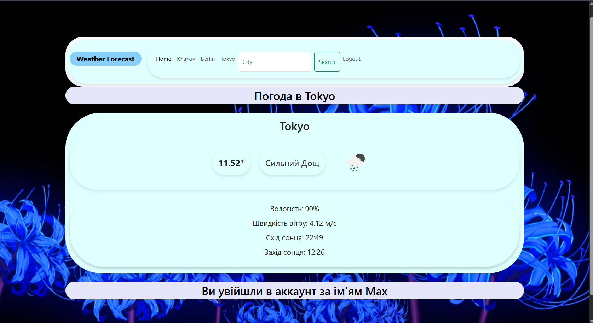
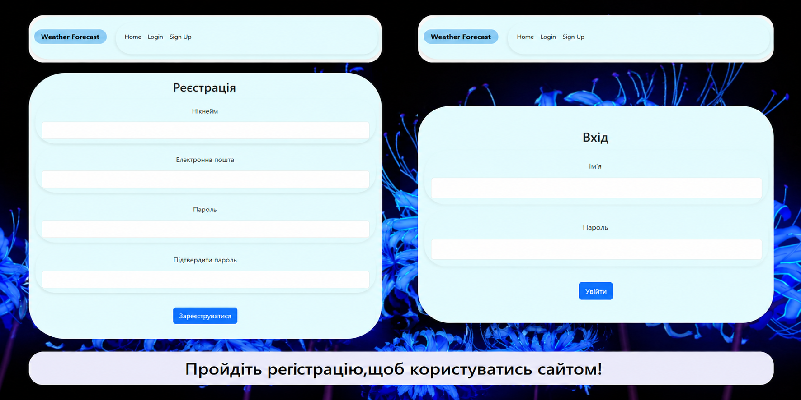

# 🌦️ Weather App (Flask)

A production-style Flask web application that provides real-time weather data using the OpenWeather API.  
Includes authentication, database persistence, and secure form handling.

---

## 🚀 Features

- 🔐 User authentication (Signup / Login / Logout)
- 🌍 Search weather by city name
- 🌡 Real-time weather data via OpenWeather API
- 🧠 Session management (Flask-Login)
- 🛡 CSRF protection (Flask-WTF)
- 🗄 SQLite database with SQLAlchemy ORM
- ⚙️ Environment-based configuration (.env support)

---
**1. Home / Home page**  


**2. Weather page**  


**3. Sign up / Login form**  



## 🛠 Tech Stack


---


---

## ⚙️ Installation

### 1. Clone repository

```bash
git clone https://github.com/your-username/weather-app.git
cd weather-app

python -m venv .venv
# Windows:
venv\Scripts\activate
# Mac/Linux:
source venv/bin/activate

pip install -r requirements.txt

SECRET_KEY=your_super_secret_key
API_KEY=your_openweather_api_key
Get API key here: https://openweathermap.org/api
python app.py